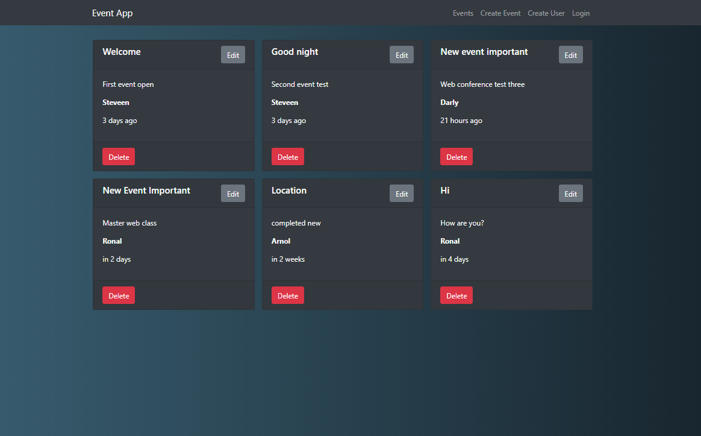

# Events-Site

[](https://github.com/StyvenSoft/Events-Site/issues)
[](https://github.com/StyvenSoft/Events-Site/stargazers)
[](https://github.com/StyvenSoft/Events-Site/blob/master/LICENSE)


Test application project to save events online with a name, a description, a time, date and url where the event will take place.

## Backend development

Stack MERN, Node & Express Web Server

- Express js [Doc](https://expressjs.com/es/starter/installing.html)
- MongoDB [Doc](https://docs.mongodb.com/manual/)

## Preview



## Installation

- MongoDB installed and configured
- Node.js and Git installed and configured
- Project cloned and dependencies installed

### Clone

- Clone this repo to your local machine using `https://github.com/StyvenSoft/Events-Site.git`

### Setup

> Update and install package first

```shell
$ cd backend/
$ npm install
```

> Running the local mongoDB server

```shell
$ npm mongod 
```

> Run API server

```shell
$ npm run dev
```

> now install npm packages frontend

```shell
$ cd frontend/
$ npm install
```

> Run project

```shell
$ npm run start
```